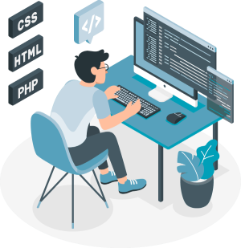

# Flavio Rafael Cardozo 👨‍💻
## Nova Odessa-SP 
## 📞 (19) 99882-1845
## 📩     
## 🔗 

## 🌐 [Instagram](https://instagram.com/flaio.t.i) 
## 🔗[GitHub](https://github.com/flavero85)

> "Em algum, algo incrível está esperando para ser descoberto." Carls Sagan
### 💻 Objetivo: Dev Front-End
- Técnico em Informática, Senac Americana [2023 - 2025]
- Tecnico em Manutenção e Suporte  informática [2022 - 2023]

## 🎓Cursos Livres
- Excel, Senac Americana [24h]
- Arduíno, Senac Americana [40h]
- Web Designer, Danki Code [90h]
- Lógica de Programação, Unicamp EAD [20h]
- Cursando Front-End e Back-End, Danki Code [1200h]

## 🗃 Experiência Profissional
- Autonômo Manutenção e Suporte a Informática 

 
  
  

